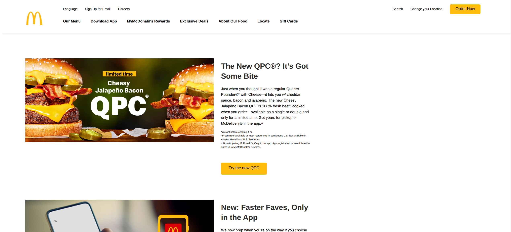

# McDonald's Website Clone



<br>

A simple static website clone of the McDonald's homepage created using HTML and CSS for learning and showcasing front-end development skills.

## How I Made This
I created this project by studying the official McDonald's website and replicating its homepage layout. I used HTML to structure the content, including the header, promotional sections for products and app features, event promotions, deals, and footer navigation with links. CSS was applied for styling, such as layout, colors, fonts, and responsiveness. Images for products, logos, and banners were placed in a dedicated folder and referenced in the HTML.

## Project Structure
- `index.html`: The main HTML file containing the page structure.
- `css/`
  - `styles.css`: CSS stylesheet for styling and layout.
- `images/`: Folder containing image assets used in the page (e.g., product images, logos, banners).

## Live Link
https://afsal4.github.io/McDonalds

## Git Clone Command
```bash
git clone https://github.com/afsal4/McDonalds.git
```
